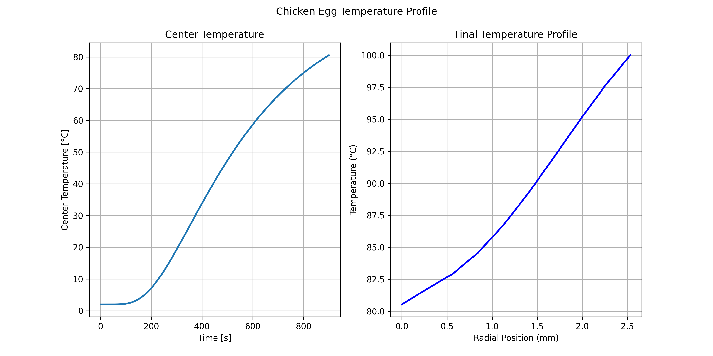
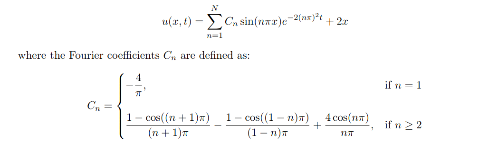
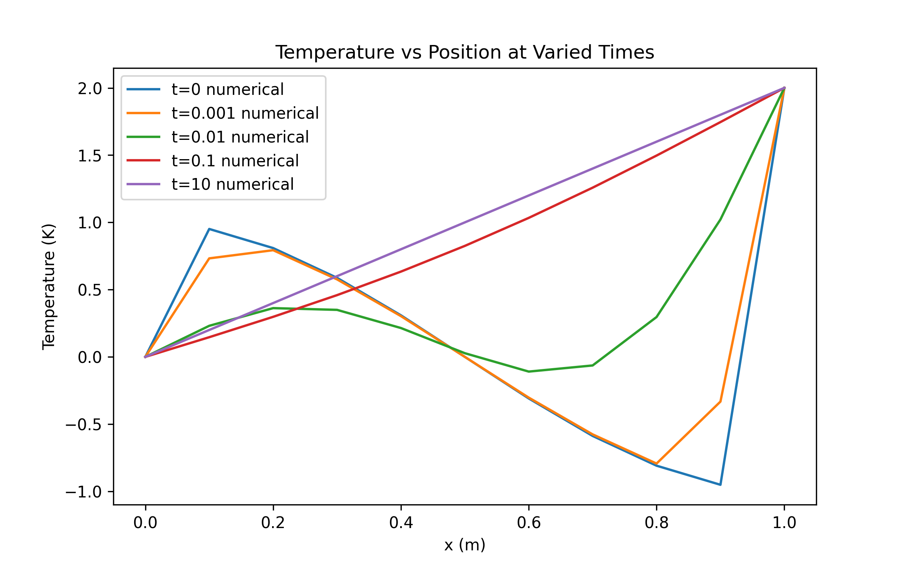
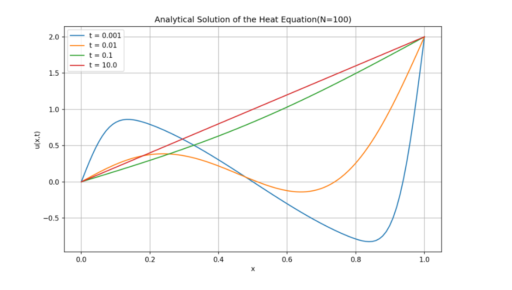

# Heat Equations

This repository contains implementations and examples related to solving heat equations, a type of partial differential equation used in various scientific and engineering fields.

## Project Structure

```
├── src/                # Source code for solving heat equations
├── plots/              # Outputs
└── README.md           # Project documentation
```

## Features
1. `q1.py` - Models the temperature of an egg while submersed in boiling water. Calculating the time to cook fully through(min internal temperature is 80 degrees Celsius for 10s)

    First the geometry of different eggs was calculated using `egg_equation.py`

    Then plots of the cooking temperatures over time were taken, are in `plots/`, the chicken egg is below:
    
    

2. `q2.py` - Solves heat equation in Cartesian coordinates:
    
    
    Comparing numerical with the following derived analytical solution:

    

    Additionally, the numerical and analytical solutions are compared using the plots below, which demonstrate their similarity. Both plots are located in the `/plots` folder:

    1. Numerical Solution:
        

    2. Analytical Solution:
        

3. The report for the project can be found [here](docs/report.pdf)

## Getting Started
Try it out!
1. Clone the repository:
    ```bash
    git clone https://github.com/your-username/heat-equations.git
    cd heat-equations
    ```

2. Install dependencies

3. Run examples or tests:
    ```bash
    python src/main.py
    ```

